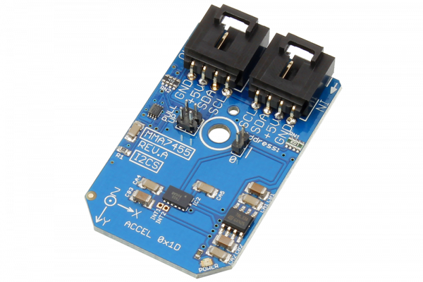

# MMA7455

Manufactured by Freescale Semiconductor, Inc., the MMA7455L 3-Axis Digital Output Accelerometer is a low power, micro-machined sensor capable of measuring acceleration along its X, Y, and Z axes.
This Device is available from www.ncd.io 

[SKU: MMA7455_I2CS]

(https://store.ncd.io/product/mma7455l-3-axis-low-g-digital-output-accelerometer-i2c-mini-module/)
This Sample code can be used with Arduino.

Hardware needed to interface MMA7455 sensor with Arduino

1. <a href="https://store.ncd.io/product/i2c-shield-for-arduino-nano/">Arduino Nano</a>

2. <a href="https://store.ncd.io/product/i2c-shield-for-arduino-micro-with-i2c-expansion-port/">Arduino Micro</a>

3. <a href="https://store.ncd.io/product/i2c-shield-for-arduino-uno/">Arduino uno</a>

4. <a href="https://store.ncd.io/product/dual-i2c-shield-for-arduino-due-with-modular-communications-interface/">Arduino Due</a>

5. <a href="https://store.ncd.io/product/mma7455l-3-axis-low-g-digital-output-accelerometer-i2c-mini-module/">MMA7455 3Axis accelometer sensor</a>

6. <a href="https://store.ncd.io/product/i%C2%B2c-cable/">I2C Cable</a>

MMA7455:

Manufactured by Freescale Semiconductor, Inc., the MMA7455L 3-Axis Digital Output Accelerometer is a low power, micro-machined sensor capable of measuring acceleration along its X, Y, and Z axes.

Applications:

• Motion sensing,event recorder,vibration monitoring and compensation, etc.

How to Use the MMA7455 Arduino Library

The MMA7455 has a number of settings, which can be configured based on user requirements.
          
1.Address calling:The following command is used to set call the address of MMA7455 sensor to begin the transmission.

            mma.getAddr_MMA7455(MMA7455_DEFAULT_ADDRESS_ACCEL);        // 0x1D
            
2.Output range selection:The following command is used to select the output range of accelometer.

            mma.setAccelRange(ACCEL_RANGE_2G);               // 2 g;
